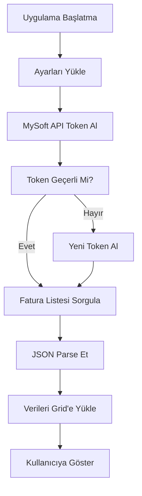

# 🏢 EFaturaDelphi - MySoft API Entegrasyon Projesi

[](https://www.embarcadero.com/products/delphi)
[](https://www.microsoft.com/windows)
[](LICENSE)
[](https://edocumentapi.mytest.tr/)

## 📋 Proje Hakkında

**EFaturaDelphi**, ERP firmaları için geliştirilmiş **Delphi** tabanlı **MySoft e-Fatura API** entegrasyon örneğidir. Bu proje, **Delphi/Object Pascal** ile e-fatura entegrasyonu yapmak isteyen ERP şirketlerine **tam kaynak kodlu**, **ücretsiz** ve **açık kaynak** bir başlangıç noktası sunar.

### 🎯 Hedef Kitle
- **ERP Yazılım Firmaları**
- **Muhasebe Yazılımı Geliştiricileri** 
- **E-Fatura Entegrasyonu Yapacak Şirketler**
- **Delphi/Object Pascal Geliştiricileri**
- **Embarcadero Delphi Kullanıcıları**

---

## 🚀 Özellikler

### ✅ **Mevcut Özellikler**
- 🔐 **MySoft API Token Yönetimi** (Otomatik yenileme)
- 📊 **Gelen Fatura Listesi Sorgulama** (18 sütunlu detaylı görünüm)
- ⚙️ **Firma Ayarları Yönetimi** (VKN/TCKN doğrulama)
- 🔒 **Güvenli API İletişimi** (HTTPS + JSON)
- 📅 **Tarih Aralığı Filtreleme**
- 💾 **Ayar Kaydetme/Yükleme** (INI dosyası)
- 🌍 **Türkçe Karakter Desteği**

### 🔄 **Planlanacak Özellikler**
- 📤 **Giden Fatura Gönderimi**
- 📥 **Fatura Detay Görüntüleme**
- 🖨️ **PDF İndirme ve Yazdırma**
- 📧 **E-posta Entegrasyonu**
- 🗄️ **Veritabanı Entegrasyonu** (MySQL, MSSQL, PostgreSQL)
- 📈 **Raporlama Modülü**

---

## 🏗️ Teknik Mimari

### 📁 **Proje Yapısı**
```
EFaturaDelphi/
├── 📄 EFaturaDelphi.dpr          # Ana proje dosyası
├── 🖼️ MainForm.pas/dfm           # Ana form (Gelen faturalar)
├── ⚙️ FirmaAyarlariForm.pas/dfm   # Firma ayarları formu
├── 🔧 SettingsManager.pas         # Ayar yönetimi sınıfı
├── 🌐 MySoftAPI.pas               # MySoft API wrapper sınıfı
└── 📚 Mysoft Entegrasyon Dokumanlari/
    ├── 🔑 Token Olusturma.md      # Token API dokümantasyonu
    └── 📋 Gelen Fatura Listesi.md # Fatura listesi API dokümantasyonu
```

### 🧩 **Sınıf Diyagramı**
```
┌─────────────────┐    ┌──────────────────┐    ┌─────────────────┐
│   TMainForm     │────│  TMySoftAPI      │────│ TSettingsManager│
│                 │    │                  │    │                 │
│ - StringGrid1   │    │ + GetToken()     │    │ + LoadSettings()│
│ - DateTimePicker│    │ + GetInvoices()  │    │ + SaveSettings()│
│ + LoadInvoices()│    │ - CreateClient() │    │ + ValidateVKN() │
└─────────────────┘    └──────────────────┘    └─────────────────┘
```

### 🔗 **API Entegrasyon Akışı**


---

## 🛠️ Kurulum ve Kullanım

### 📋 **Sistem Gereksinimleri**
- **Delphi 10.3 Rio** veya üzeri (Community Edition uyumlu)
- **Windows 10/11** (32-bit/64-bit)
- **Internet bağlantısı** (MySoft API erişimi için)
- **MySoft e-Fatura hesabı** (Test/Canlı ortam)

### 🔧 **Kurulum Adımları**

#### 1️⃣ **Projeyi İndirin**
```bash
git clone https://github.com/mukerremmert/MySoftDelphi.git
cd MySoftDelphi
```

#### 2️⃣ **Delphi'de Açın**
- Delphi IDE'yi açın
- `EFaturaDelphi.dpr` dosyasını açın
- **F9** ile derleyin ve çalıştırın

#### 3️⃣ **MySoft API Bilgilerini Girin**
- **"Firma Ayarları"** sekmesini açın
- MySoft API bilgilerinizi girin:
  ```
  API URL: https://edocumentapi.mytest.tr/
  Kullanıcı Adı: [MySoft kullanıcı adınız]
  Şifre: [MySoft şifreniz]
  ```

#### 4️⃣ **Test Edin**
- **"Gelen Faturalar"** sekmesine geçin
- **"Sorgula"** butonuna tıklayın
- Fatura listesini görüntüleyin

---

## 💻 **ERP Firmları İçin Entegrasyon Rehberi**

### 🏢 **ERP Sistemine Entegrasyon**

#### **1. Veritabanı Entegrasyonu**
```pascal
// Örnek: MySQL veritabanına fatura kaydetme
procedure SaveInvoiceToDatabase(const InvoiceObj: TJSONObject);
var
  Query: TFDQuery;
begin
  Query := TFDQuery.Create(nil);
  try
    Query.Connection := DatabaseConnection;
    Query.SQL.Text := 
      'INSERT INTO Invoices (ID, DocNo, DocDate, VknTckn, AccountName, Amount, Status) ' +
      'VALUES (:ID, :DocNo, :DocDate, :VknTckn, :AccountName, :Amount, :Status)';
    
    Query.ParamByName('ID').AsString := InvoiceObj.GetValue<string>('id');
    Query.ParamByName('DocNo').AsString := InvoiceObj.GetValue<string>('docNo');
    // ... diğer parametreler
    
    Query.ExecSQL;
  finally
    Query.Free;
  end;
end;
```

#### **2. Business Logic Entegrasyonu**
```pascal
// Örnek: Fatura durumuna göre iş akışı
procedure ProcessInvoiceStatus(const Status: string; const InvoiceID: string);
begin
  case Status of
    'KABUL': 
    begin
      // Fatura kabul edildi - muhasebe fişi oluştur
      CreateAccountingEntry(InvoiceID);
      SendNotification('Fatura kabul edildi: ' + InvoiceID);
    end;
    
    'RED':
    begin
      // Fatura reddedildi - red sebebini logla
      LogRejection(InvoiceID);
      SendAlert('Fatura reddedildi: ' + InvoiceID);
    end;
    
    'BEKLEMEDE':
    begin
      // Beklemede - takip listesine ekle
      AddToFollowUpList(InvoiceID);
    end;
  end;
end;
```

#### **3. Multi-Tenant Desteği**
```pascal
// Örnek: Çoklu firma desteği
type
  TCompanySettings = record
    CompanyID: Integer;
    VKN: string;
    MySoftUsername: string;
    MySoftPassword: string;
    APIEndpoint: string;
  end;

procedure ProcessCompanyInvoices(const Company: TCompanySettings);
var
  API: TMySoftAPI;
  Token: string;
begin
  // Her firma için ayrı API instance
  Token := TMySoftAPI.GetToken(Company.MySoftUsername, Company.MySoftPassword, Company.APIEndpoint);
  if Token <> '' then
  begin
    // Firma bazında fatura işlemleri
    ProcessInvoicesForCompany(Company.CompanyID, Token);
  end;
end;
```

### 📊 **Performans Optimizasyonu**

#### **1. Token Yönetimi**
```pascal
// Token cache mekanizması
type
  TTokenCache = class
  private
    FToken: string;
    FExpireTime: TDateTime;
  public
    function GetValidToken(const Username, Password: string): string;
    procedure InvalidateToken;
  end;
```

#### **2. Batch İşleme**
```pascal
// Toplu fatura işleme
procedure ProcessInvoicesBatch(const Invoices: TJSONArray);
var
  i: Integer;
  BatchSize: Integer;
begin
  BatchSize := 100; // 100'lü gruplar halinde işle
  
  for i := 0 to (Invoices.Count div BatchSize) do
  begin
    ProcessInvoiceBatch(i * BatchSize, Min((i + 1) * BatchSize, Invoices.Count));
    
    // Memory yönetimi
    if i mod 10 = 0 then
      Application.ProcessMessages;
  end;
end;
```

---

## 🔐 **Güvenlik Önlemleri**

### 🛡️ **API Güvenliği**
- ✅ **HTTPS** zorunlu iletişim
- ✅ **Token-based** authentication
- ✅ **Request/Response** loglaması
- ✅ **Error handling** ve güvenli hata mesajları

### 🔒 **Veri Güvenliği**
```pascal
// Örnek: Şifre şifreleme
function EncryptPassword(const PlainPassword: string): string;
begin
  // AES-256 şifreleme kullanın
  Result := AESEncrypt(PlainPassword, GetSystemKey());
end;

function DecryptPassword(const EncryptedPassword: string): string;
begin
  Result := AESDecrypt(EncryptedPassword, GetSystemKey());
end;
```

---

## 📚 **API Dokümantasyonu**

### 🔗 **MySoft API Endpoints**

#### **1. Token Alma**
```http
POST https://edocumentapi.mytest.tr/api/Auth/Login
Content-Type: application/json

{
  "username": "kullanici_adi",
  "password": "sifre"
}
```

#### **2. Gelen Fatura Listesi**
```http
POST https://edocumentapi.mytest.tr/api/EInvoice/GetInboxInvoiceList
Authorization: Bearer [TOKEN]
Content-Type: application/json

{
  "startDate": "2025-01-01",
  "endDate": "2025-01-31",
  "pageSize": 100,
  "pageNumber": 1
}
```

### 📋 **Response Formatları**

#### **Fatura Listesi Response**
```json
{
  "data": [
    {
      "id": 104298,
      "docNo": "AA52025000000054",
      "docDate": "2025-01-10T00:00:00+03:00",
      "vknTckn": "6271036106",
      "accountName": "FIRMA ADI",
      "profile": "TICARIFATURA",
      "invoiceType": "TEVKIFAT",
      "ettn": "8c96ca19-323e-4567-b890-1234567890ab",
      "pkAlias": "urn:mail:adpkdemo",
      "gbAlias": "urn:mail:asdgbdemo",
      "lineExtensionAmount": 10000.00,
      "taxExclusiveAmount": 10000.00,
      "taxInclusiveAmount": 12000.00,
      "payableAmount": 10600.00,
      "taxTotalTra": 600.00,
      "allowanceTotalAmount": 0.00,
      "payableRoundingAmount": 0.00,
      "invoiceStatusText": "KABUL"
    }
  ],
  "totalCount": 1,
  "pageNumber": 1,
  "pageSize": 100
}
```

---

## 🤝 **Katkıda Bulunma**

### 💡 **Nasıl Katkı Sağlayabilirsiniz?**
1. **🍴 Fork** edin
2. **🌿 Feature branch** oluşturun (`git checkout -b feature/YeniOzellik`)
3. **💾 Commit** yapın (`git commit -m 'Yeni özellik eklendi'`)
4. **📤 Push** edin (`git push origin feature/YeniOzellik`)
5. **🔄 Pull Request** oluşturun

### 🐛 **Bug Raporlama**
- GitHub Issues kullanın
- Detaylı açıklama yapın
- Hata logları ekleyin
- Sistem bilgilerini belirtin

---

## 📞 **İletişim ve Destek**

### 👨‍💻 **Geliştirici İletişim**
- **📧 E-posta**: info@mertbilisim.com.tr
- **👤 GitHub**: [@mukerremmert](https://github.com/mukerremmert)
- **🏢 Firma**: Mert Bilişim

### 🆘 **Teknik Destek**
- **🐛 Bug Report**: GitHub Issues
- **💬 Soru-Cevap**: GitHub Discussions
- **📖 Dokümantasyon**: Wiki sayfaları

### 🤝 **ERP Firmaları İçin Özel Destek**
ERP entegrasyonu konusunda özel destek almak isteyen firmalar için:
- **📧 Doğrudan iletişim**: info@mertbilisim.com.tr
- **🔧 Özelleştirme hizmetleri**
- **📚 Eğitim ve danışmanlık**
- **🚀 Kurumsal destek paketleri**

---

## 📄 **Lisans**

Bu proje **MIT Lisansı** altında yayınlanmıştır. Detaylar için [LICENSE](LICENSE) dosyasını inceleyiniz.

### 🆓 **Ücretsiz Kullanım**
- ✅ Ticari kullanım serbest
- ✅ Kaynak kodu değiştirme serbest  
- ✅ Dağıtım serbest
- ✅ Özel kullanım serbest

---

## ⭐ **Yıldız Verin!**

Bu proje işinize yaradıysa, lütfen **⭐ yıldız** vererek destekleyin!

---

## 🏷️ **Sürüm Geçmişi**

### 📋 **v1.0.0** (2025-01-11)
- ✅ MySoft API Token yönetimi
- ✅ Gelen fatura listesi sorgulama
- ✅ 18 sütunlu detaylı fatura görünümü
- ✅ Firma ayarları yönetimi
- ✅ VKN/TCKN doğrulama
- ✅ Tarih filtreleme
- ✅ Türkçe karakter desteği

### 🔮 **Gelecek Sürümler**
- 🔄 **v1.1.0**: Giden fatura gönderimi
- 🔄 **v1.2.0**: PDF indirme ve yazdırma
- 🔄 **v1.3.0**: Veritabanı entegrasyonu
- 🔄 **v2.0.0**: Multi-provider desteği (Foriba, Kolaysoft, ICE)

---

*Bu proje, Türkiye'deki ERP firmalarının e-fatura entegrasyonu sürecini kolaylaştırmak amacıyla geliştirilmiştir. 🇹🇷*